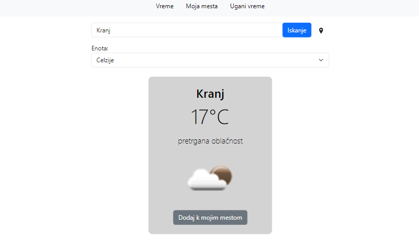
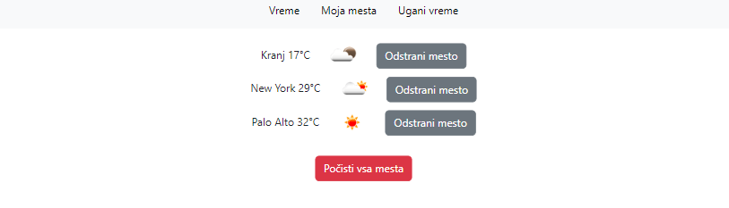
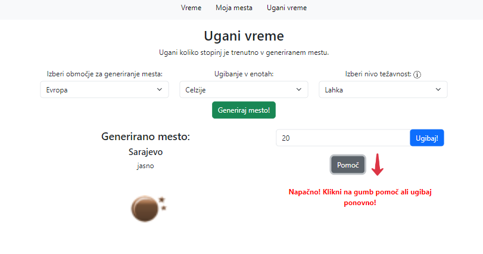

# Simple weather 

Yet another simple web app I had to build for school. Pretty basic weather app using the [OpenWeatherMap API](https://openweathermap.org/). 

## Features
- Search weather data by city or by current location
- Save cities to "My cities" (saves to local storage)
- Guess weather game
    - Randomly generates a city (from Slovenia, Europe, entire world or from my cities list)
    - Displays current weather condition (depending on the difficulty level)
    - User guesses degrees in the city - either in °C or °F
    - Help button - higher or lower than inputted

## Tech stack
- HTML
- CSS
- JS
- Bootstrap

## Gallery

  

  

  

